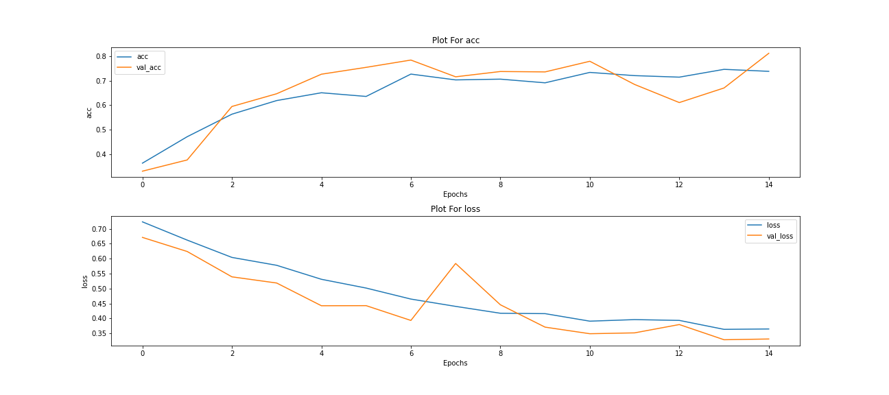
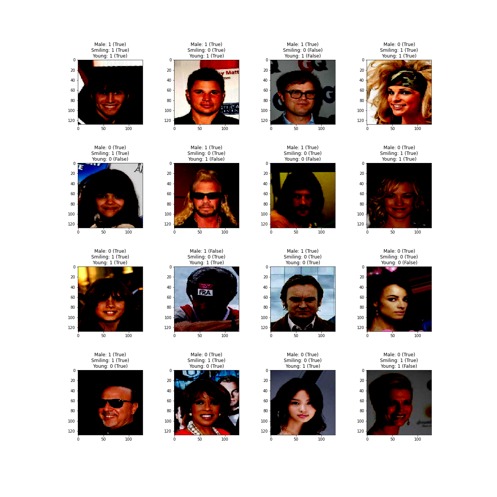
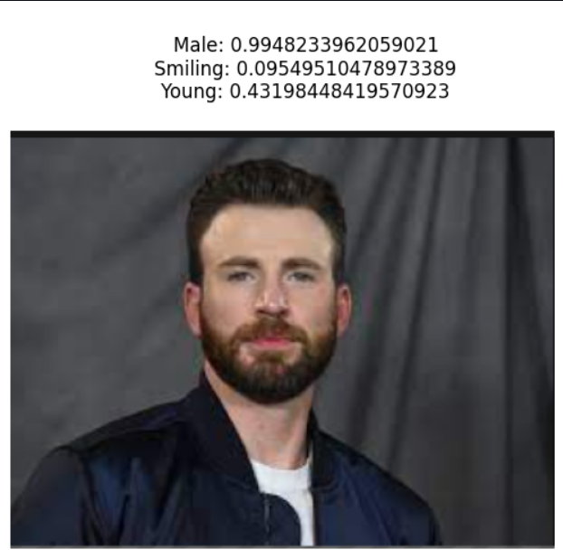
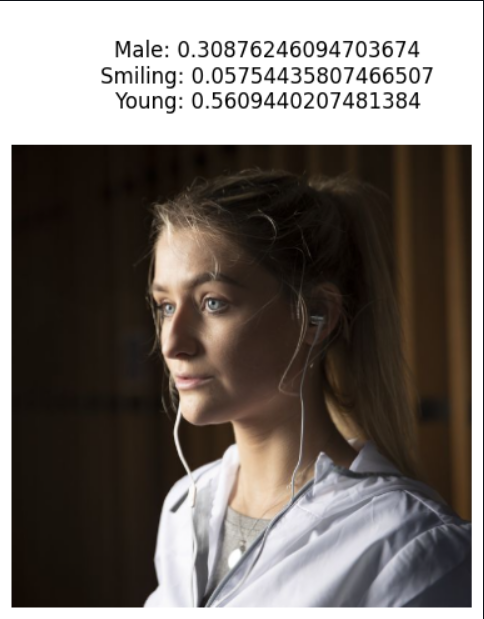
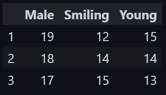

# **Face Analytics**
Dataset Used: [CelebFaces Attributes (CelebA) Dataset](https://www.kaggle.com/datasets/jessicali9530/celeba-dataset?select=list_landmarks_align_celeba.csv)
## Specifications
- The model uses transfer learning from keras InceptionV3
- Model Accuracy
```
Accuracy:		0.907
Male Accuracy:		0.98
Smiling Accuracy:	0.86
Young Accuracy:		0.88
```
## Inputs
- The Model Takes an image as input of size (128 x 128)
- The image is then preprocessed before passing to model
## Outputs
- Model is predicting outputs for 3 classes
  - Male | Female
  - Smiling | Not Smiling
  - Young | Aged
## Training Plot

## Test Results

## Sample Results


## Correct Images out of 20 Total for 3 models
